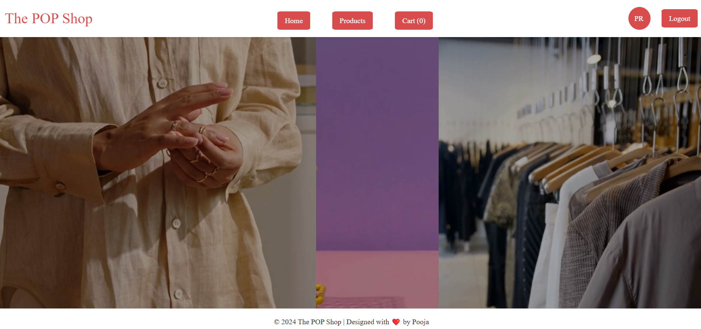
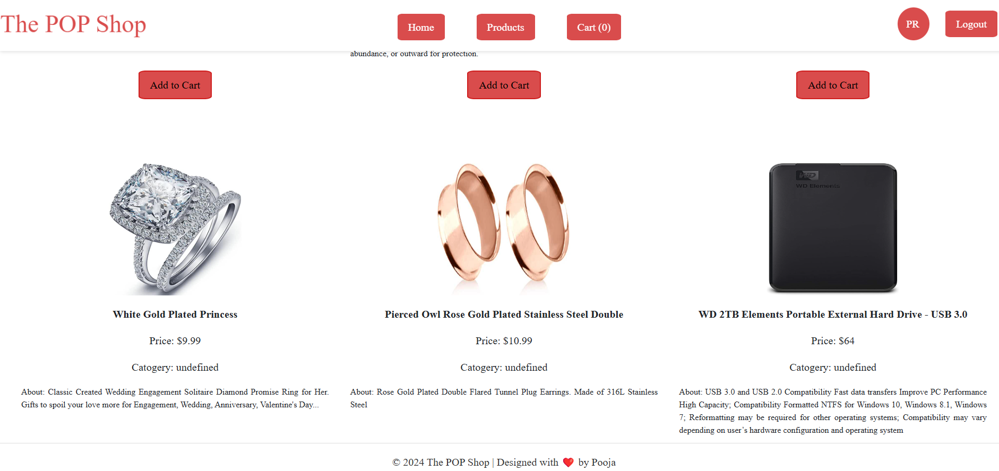
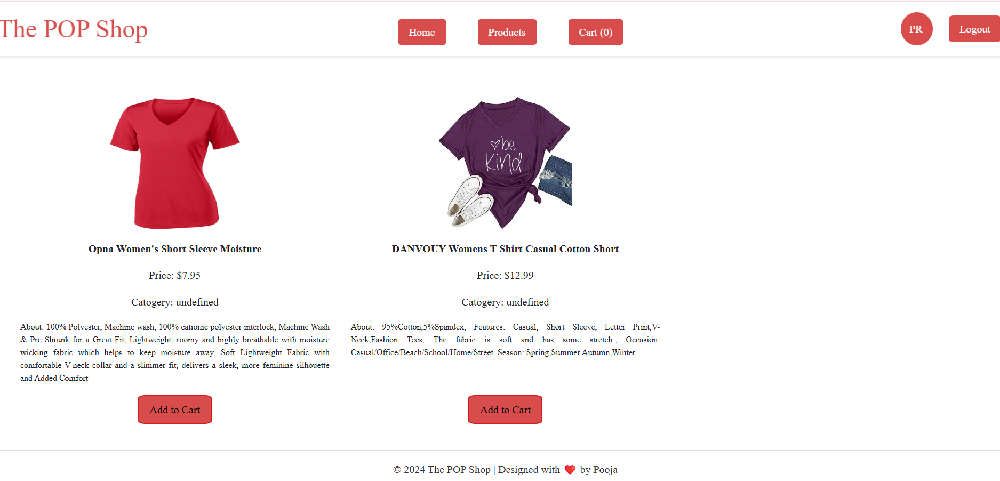
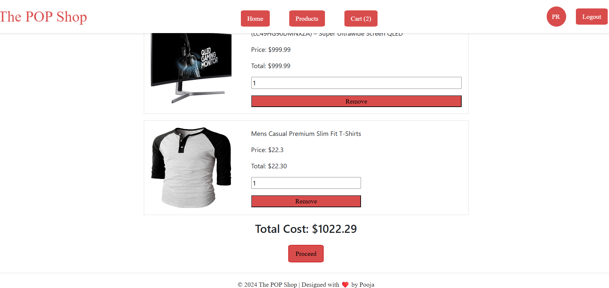
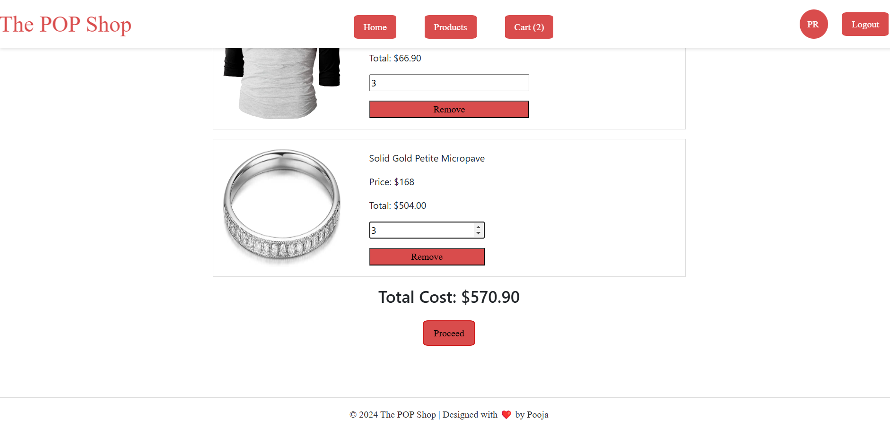
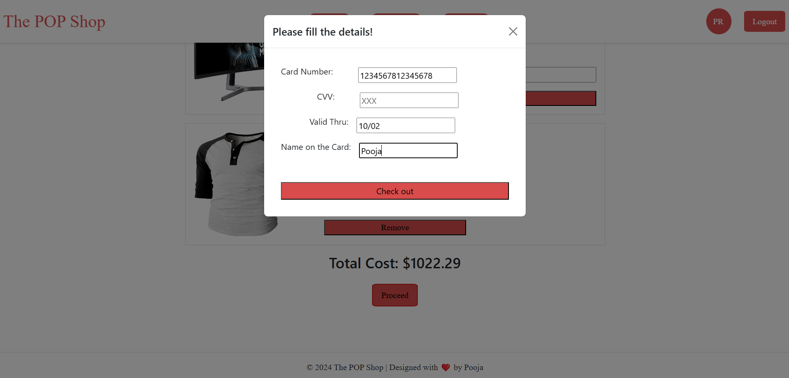
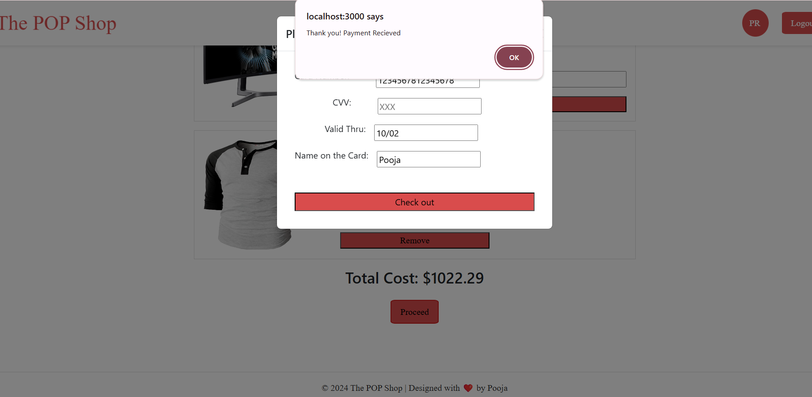
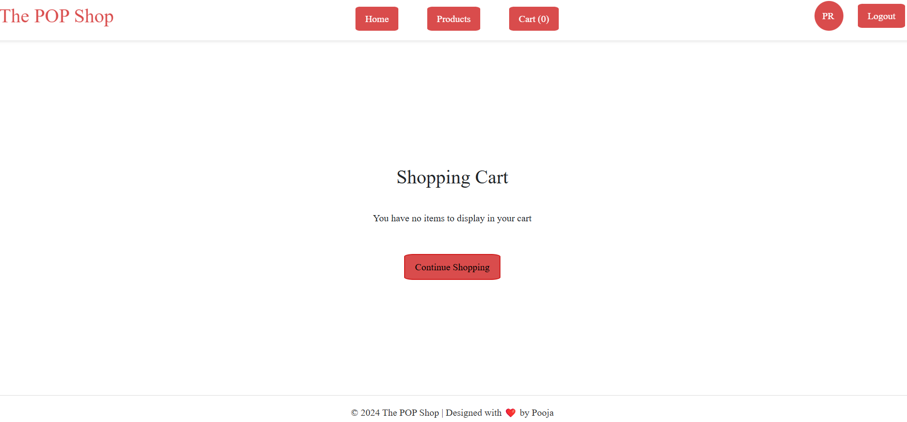

Introduction-
PopShop
PopShop is a web-based e-commerce application that allows users to browse products, add them to a cart, and complete their purchases seamlessly. This repository contains all the necessary files for deploying and managing the application.

Screenshots-

loginpage:
homepage:
productspage:
cartpage:
checkout:
payment-successfull:
continueshopping:

Features-
-->Login Page(User Authentication): Secure login system for user accounts.The Login Page accepts any user credentials (username and password) without validation. The "Login" button remains disabled until both fields are populated, after which it becomes active.
-->HomePage:After a successful login, the user is redirected to the Home Page, which features a navigation menu with options such as Home, Products, Shopping Cart, and Contact. The top section displays the user's Avatar along with a Logout button.
-->Products Page(Product Listings): Dynamic display of products with filtering options.Displays product data fetched from the PHP backend, which pulls data from an external API. Products include details such as title, price, category, description, and image. Each product has an Add to Cart button that navigates to the cart page.
-->Cart Page (Shopping Cart): Add, update, and remove products in the cart.The Cart Page lists the items added to the cart. Users can adjust the quantity of each item, and the total price dynamically updates based on these changes. Multiple items can be added to the cart. A "Process" button is provided to open a modal where users can input their card details.
-->Checkout(Payment Successful): Seamless checkout process with payment integration.Once card details are entered, a confirmation alert notifies the user of successful payment. The user is then redirected back to the Home Page.
-->Responsive Design: Works across devices, ensuring a mobile-friendly experience.

Setup and Installation-
Prerequisites:
Ensure the following are installed on your system:
-->Node.js
-->npm (Node Package Manager)
-->Git
-->Browser to access the web app.
Installation Steps
--> Clone the Repository:
git clone https://github.com/rajupooja1211/PopShop.git
--> Navigate to the frontend directory and install the necessary dependencies: cd frontend npm install
-->Start the PHP server: php -S localhost:8000
Run the Application:
npm start
The application will be available at http://localhost:3000.

Technologies Used-
-->Frontend:
React: For creating a dynamic and responsive user interface.
Bootstrap: For consistent and modern styling of components.
Redux: For efficient state management, particularly for handling cart functionality.
React Router: For seamless navigation between pages.
-->Backend:
PHP: For managing API calls and serving data to the frontend.
cURL in PHP: To fetch data from an external API and integrate it into the application.

